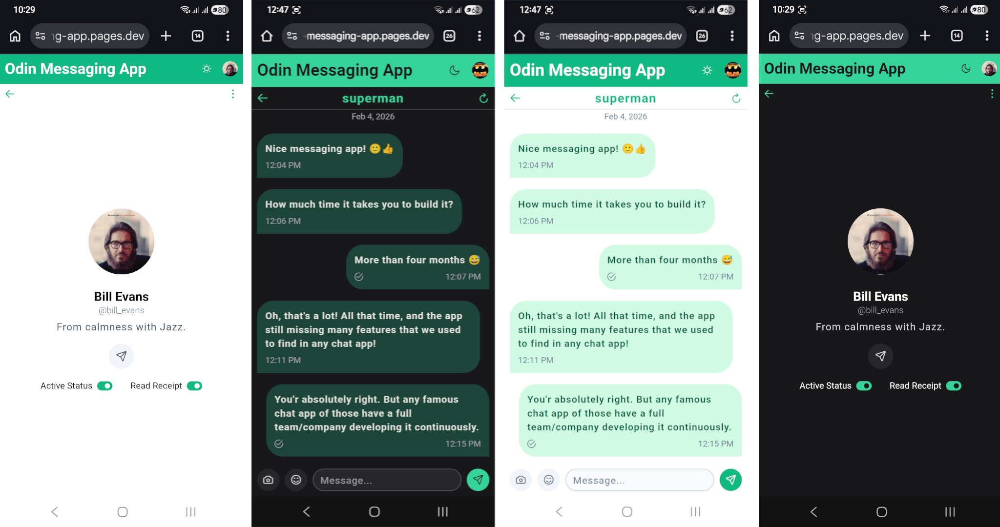

# [Odin Messaging App](https://odin-messaging-app.pages.dev/)

A web app that lets users send messages to each other, built as part of studying **[The Odin Project's Node.js course](https://www.theodinproject.com/paths/full-stack-javascript/courses/nodejs)**.

---

## Screenshots




[More screenshots...](https://drive.google.com/drive/folders/1QGo7zjzM16HDQTO3Kg39rFpP_ONf77gV)

---

## Overview

This app allows authenticated users to:

- Sign up, sign in, and sign out (including guest sign-in)
- Edit profile data
- Upload, update, and delete a profile picture
- Browse, search, filter profiles, and follow/unfollow other users
- Send text messages that could contain an image, and/or emojis 😎
- Track the message's seen/received states

The project emphasizes predictable state management, clean separation of concerns.

---

## Tech Stack

This project focuses on client–server architecture, authentication, and managing complex UI state in a modern Angular application.

### Frontend

The is a modern, _zoneless_ Angular app; It utilizes new features such as: **Signals**, **Effects**, **Vitest Unit testing**, and more.

Beside the Angular's `HttpClint` usage, this app utilizes the **RxJS** for many custom usages.

**Here are some of the technologies used on the frontend**:

- Angular 21
- TypeScript
- RxJS
- Vitest
- tailwindcss
- Angular Testing Library
- PrimeNG with Tailwind-based theming

### Backend

This repository contains the **front-end application**, which communicates with the back-end API from the [Generic Express Service](https://github.com/hussein-m-kandil/generic-express-service).

**Here are some of the technologies used on the backend**:

- Node.js/Express
- PostgreSQL
- Prisma
- Passport
- JWT-based authentication

---

## Testing

Component tests utilizes **Vitest**, **JSDOM**, and the [**Angular Testing Library**](https://testing-library.com/docs/angular-testing-library/intro), while service tests rely on Angular’s built-in testing utilities.

The [`MessageForm`](./src/app/chats/chat-room/message-form/message-form.spec.ts) component has one of the most interesting tests, such as the emoji insertion test. 😉

---

## Local Development

### Requirements

- [Angular CLI v21](https://angular.dev/installation#install-angular-cli) installed globally.
- A local clone of the [Generic Express Service](https://github.com/hussein-m-kandil/generic-express-service).

### Setup

#### 1. Clone and set up the backend

_Refer to the [Generic Express Service repository](https://github.com/hussein-m-kandil/generic-express-service) for more information_.

```bash
git clone git@github.com:hussein-m-kandil/generic-express-service.git
cd generic-express-service
npm install
# Configure the .env file (DB connection, ports, etc.)
cp .env.test .env
# Start PostgreSQL via Docker Compose
npm run pg:up
# Build and start the backend in production mode
npm run build
npm start
```

The app should be available at [http://localhost:8080](http://localhost:8080).

#### 2. Clone and set up this project

```bash
git clone git@github.com:hussein-m-kandil/odin-messaging-app.git
cd odin-messaging-app
npm install
# Copy the environment file for development
cp src/environments/environment.development.ts src/environments/environment.ts
# Run tests to verify setup (optional)
npm run test -- --run
# Start the development server
npm start
```

The app will be available at <http://localhost:4200>.

---

## Scripts

| Command              | Description                                    |
| -------------------- | ---------------------------------------------- |
| `npm install`        | Installs dependencies.                         |
| `npm start`          | Starts the development server.                 |
| `npm test`           | Runs all project tests.                        |
| `npm lint`           | Checks for linting issues.                     |
| `npm run build`      | Builds the project for production.             |
| `npm run type-check` | Type-checks all source files.                  |
| `npm run build:zip`  | Builds the project and zips the browser files. |

---

## Project Status & Maintenance

This project was built primarily for learning and practice as part of The Odin Project. It is not intended for long-term maintenance or production use.

To keep public demos manageable, I have implemented backend logic that automatically resets the database state at regular intervals.
